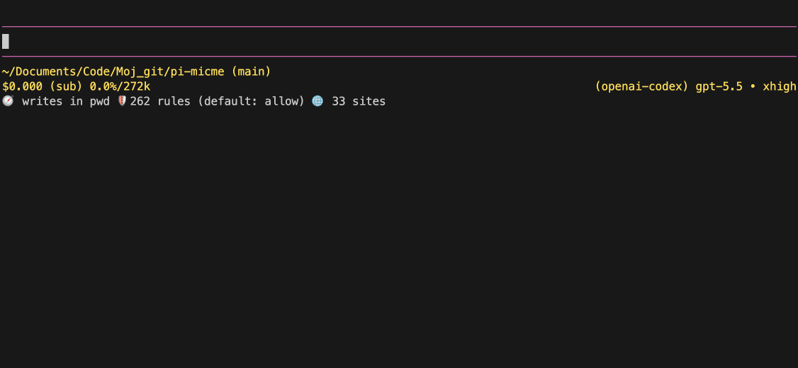

<p align="center">
  
</p>

<p align="center">
  <a href="https://pi.dev"></a>
  <a href="https://www.npmjs.com/package/@senad-d/micme"></a>
  <a href="LICENSE"></a>
</p>

<p align="center">
  Local voice-to-text for <a href="https://pi.dev">pi</a>.
  <br />Tap a shortcut, speak, and paste the transcript into pi's editor.
</p>

---

MicMe is a Pi extension for coding prompts. It records your microphone with `ffmpeg`, transcribes locally with `whisper.cpp` or another local backend, and inserts the transcript into pi.

<table align="center">
  <tr>
    <th>MicMe demo</th>
  </tr>
  <tr>
    <td align="center">
      
    </td>
  </tr>
</table>

- **Local-first:** no telemetry and no cloud STT service by default.
- **Review-first:** transcripts paste into the editor unless you enable auto-submit.
- **Pi-native:** install globally, project-locally, from git, or from a source checkout.
- **Configurable:** use `/micme conf`, `~/.pi/agent/micme.json`, or shell variables.

> **Security:** pi packages run with your full system permissions. Micme can use your microphone, spawn local commands, write `MICME_*` settings to `~/.pi/agent/micme.json`, and optionally download Whisper model files. Read [`SECURITY.md`](SECURITY.md).

## Table of Contents

- [Quick Start](#quick-start)
- [Installation](#installation)
- [Backend Setup](#backend-setup)
- [Configuration](#configuration)
- [Commands](#commands)
- [Models and Backends](#models-and-backends)
- [Troubleshooting](#troubleshooting)
- [Diagnostics](#diagnostics)
- [Update and Uninstall](#update-and-uninstall)
- [Development](#development)
- [Publishing](#publishing)
- [License](#license)

---

## Quick Start

```bash
pi install npm:@senad-d/micme
```

Install a local backend. On macOS:

```bash
brew install ffmpeg whisper-cpp
```

Start pi and configure Micme:

```bash
pi
```

```text
/micme conf
/micme devices
```

Use it:

1. Press `alt+m` / `Option+m` to start recording.
2. Speak your prompt.
3. Press `alt+m` again to stop.
4. Review the pasted transcript and press Enter.

Micme is toggle-based. Press-and-hold recording is not used because terminal key-up events are not portable.

---

## Installation

| Scope | Command | Notes |
| --- | --- | --- |
| Global | `pi install npm:@senad-d/micme` | Loads in every trusted pi project. |
| Project-local | `pi install npm:@senad-d/micme -l` | Writes to `.pi/settings.json` in the current project. |
| One run | `pi -e npm:@senad-d/micme` | Try without changing settings. |
| Git | `pi install git:github.com/senad-d/micme@<tag>` | Pin a tag or commit. |
| Local checkout | `pi -e .` | Develop or test this repository. |

Source checkout:

```bash
git clone https://github.com/senad-d/micme.git
cd micme
npm install --ignore-scripts
npm run doctor
pi -e .
```

Use the checkout globally while developing:

```bash
pi install /absolute/path/to/micme
```

---

## Backend Setup

Micme does not bundle recorder, transcriber, or model binaries.

| OS | Install | Device setting |
| --- | --- | --- |
| macOS | `brew install ffmpeg whisper-cpp` | Run `/micme devices`, then set `MICME_AUDIO_DEVICE=<audio id>` or `MICME_AVFOUNDATION_INPUT=:<audio id>`. |
| Linux | Install `ffmpeg` and `whisper.cpp` with your package manager, Nix, Homebrew, or source build. | `MICME_PULSE_SOURCE=default` |
| Windows | `winget install Gyan.FFmpeg`, then install/build `whisper.cpp`. | `MICME_DSHOW_AUDIO_DEVICE=Microphone Name` |

List devices inside pi:

```text
/micme devices
```

macOS device listing outside pi:

```bash
ffmpeg -hide_banner -f avfoundation -list_devices true -i ""
```

If `whisper-cli` is not on `PATH`, set it explicitly:

```env
MICME_WHISPER_CPP_BIN=/path/to/whisper-cli
MICME_WHISPER_CPP_MODEL=/path/to/ggml-small.en.bin
```

---

## Configuration

MicMe reads settings from shell environment variables and from the global Micme config file at `~/.pi/agent/micme.json`. Shell variables win. `/micme conf` writes only `MICME_*` keys to that JSON file, so settings follow you across pi projects on the same machine.

The usual setup path is to run:

```text
/micme conf
```

You can also edit the JSON manually. Minimal `~/.pi/agent/micme.json`:

```json
{
  "$schema": "https://raw.githubusercontent.com/senad-d/micme/main/micme.schema.json",
  "MICME_LANGUAGE": "en",
  "MICME_TRANSLATE_TO_ENGLISH": "off",
  "MICME_TRANSCRIBE_BACKEND": "auto",
  "MICME_AUTO_DOWNLOAD_MODEL": "1",
  "MICME_DEFAULT_WHISPER_CPP_MODEL": "small.en",
  "MICME_AUTO_SUBMIT": "0",
  "MICME_KEEP_AUDIO": "0"
}
```

For temporary one-off overrides, set shell variables when starting pi, for example `MICME_KEEP_AUDIO=1 pi`.

Common settings:

| Variable | Meaning |
| --- | --- |
| `MICME_TRANSCRIBE_BACKEND=auto` | Backend selector. `auto` preserves priority: custom command, whisper.cpp, then Python Whisper. |
| `MICME_TRANSCRIPTION_MODE=clip` | Stable default: transcribe after recording stops. |
| `MICME_TRANSCRIPTION_MODE=stream` | Experimental append-only live dictation with `whisper-stream`; requires whisper.cpp. |
| `MICME_LANGUAGE=en` | Transcription language when translation is off. Use `auto` for detection. |
| `MICME_TRANSLATE_TO_ENGLISH=off` | “Translate from” option. Leave `off`, or set the spoken source language code such as `hr`, `bs`, `de`, or `tr` to output English. |
| `MICME_STREAM_KEEP_CONTEXT=0` | Stream default: avoid Whisper prompt carry-over so live chunks are less likely to rewrite each other. |
| `MICME_STREAM_FLUSH_MS=650` | Stream profile quiet interval before tentative words are committed append-only. |
| `MICME_STREAM_FINALIZE_WITH_CLIP=0` | Keep the append-only live transcript on stop. Set `1` to opt in to final clip replacement. |
| `MICME_AUTO_SUBMIT=0` | Paste for review. Set `1` to send automatically. |
| `MICME_SHORTCUT=alt+m` | Toggle shortcut. Use terminal syntax (`alt+m`, `ctrl+space`, `f8`) or a printable character such as `§`. Restart or `/reload` after changing. |
| `MICME_VALIDATE_AUDIO=1` | Reject near-silent recordings. |
| `MICME_RECORD_SAMPLE_RATE=auto` | Raw recording sample-rate override. Leave `auto` so ffmpeg uses the selected input's native rate. |
| `MICME_RECORD_SYNC=1` | Automatically preserve wall-clock recording duration from ffmpeg timestamps. |
| `MICME_RECORD_METER=0` | Quality-safe default: meter from `raw.wav` instead of a second ffmpeg stdout branch. Set `1` to restore the legacy live meter pipe. |
| `MICME_AVFOUNDATION_DROP_LATE_FRAMES=0` | macOS only: ask AVFoundation not to drop late frames when capture lags. |
| `MICME_KEEP_AUDIO=0` | Delete successful recording audio. Set `1` to keep each recording under `./micme-rec/rec-###/` for debugging. |
| `MICME_MODEL_DIR=~/.cache/whisper.cpp` | Model cache/discovery directory. |

See [`micme.example.json`](micme.example.json) for the full JSON template.

Streaming mode treats `whisper-stream` output as repeated, overlapping hypotheses rather than committed word deltas. Micme only appends committed words to the editor during live streaming; tentative words are held internally and committed after agreement, overlap, stop, or the quiet interval configured by `MICME_STREAM_FLUSH_MS`. If `MICME_STREAM_FINALIZE_WITH_CLIP=1`, the stop-time clip transcript can intentionally replace the live append-only text.

---

## Commands

| Command | Description |
| --- | --- |
| `/micme` | Toggle recording. |
| `/micme conf` | Open the TUI configuration screen. |
| `/micme devices` | Show compact audio/video capture device inventory. |
| `/micme last` | Paste the previous transcript again. |
| `/micme audio` | Show the last kept audio directory. |
| `/micme help` | Show short help. |

---

## Models and Backends

Micme supports these backend values in JSON/env config:

- `whisper.cpp`: uses `whisper-cli`/`whisper-cpp` and a ggml/gguf model path.
- `python`: uses the OpenAI Whisper `whisper` CLI and a Python model name.

`/micme conf` keeps the interactive backend picker focused on `whisper.cpp` and `Python Whisper`, then shows only the model/binary fields for the selected backend. For whisper.cpp, `MICME_WHISPER_CPP_MODEL` is the selected ggml/gguf model path; if it is unset, Micme falls back to `${MICME_MODEL_DIR}/ggml-${MICME_DEFAULT_WHISPER_CPP_MODEL}.bin`. For Python Whisper, `MICME_WHISPER_MODEL` is passed as the CLI model name.

With `MICME_AUTO_DOWNLOAD_MODEL=1`, Micme downloads missing standard whisper.cpp models into `MICME_MODEL_DIR`. Disable downloads with:

```env
MICME_AUTO_DOWNLOAD_MODEL=0
```

Recommended model progression: `base.en` for speed, `small.en` for a stronger default, `medium.en` for accuracy. Translation uses Whisper's built-in translate task and needs translate-capable multilingual models; when `MICME_TRANSLATE_TO_ENGLISH` is enabled, Micme maps `.en` model names to multilingual defaults (`small.en` → `small`, `base.en` → `base`) and maps non-translation turbo models to the closest translate-capable model (`large-v3-turbo` → `large-v3`).

Advanced users can replace the recorder or transcriber:

```env
MICME_RECORD_COMMAND=ffmpeg -hide_banner -loglevel error -f avfoundation -i :0 -af aresample=async=1:first_pts=0 -ac 1 -y {audio}
MICME_TRANSCRIBE_COMMAND=whisper-cli -m /path/to/model.bin -f {audio} -otxt -of {tempDirRaw}/out -nt -np && cat {tempDirRaw}/out.txt
```

`{audio}`, `{tempDir}`, and `{transcript}` are shell-quoted. `*Raw` placeholders bypass quoting and should only be used when you fully control the command.

---

## Troubleshooting

| Problem | Try |
| --- | --- |
| No backend found | Use `/micme conf` to choose `whisper.cpp` or Python Whisper, install the selected backend, or configure a trusted custom command manually. |
| Wrong microphone | Run `/micme devices`, then set the OS-specific device variable. |
| Crackling or shortened audio | Keep `MICME_RECORD_SYNC=1` and `MICME_RECORD_METER=0`; on macOS keep `MICME_AVFOUNDATION_DROP_LATE_FRAMES=0`, and avoid Aggregate/BlackHole devices unless intentionally routing audio. |
| Unrelated transcript | You probably recorded silence. Set `MICME_KEEP_AUDIO=1` and check `/micme audio`. |
| Slow transcription | Use `whisper.cpp`, a smaller model, and shorter recordings. |
| Option/Alt inserts `§` or `µ` | Set `MICME_PRINTABLE_SHORTCUTS=§` or change `MICME_SHORTCUT`, then `/reload`. |
| Need automatic sending | Set `MICME_AUTO_SUBMIT=1`. |

---

## Diagnostics

```bash
npx -p @senad-d/micme micme-doctor
```

From a source checkout:

```bash
npm run doctor
```

The doctor checks Node, pi, `ffmpeg`, requested/effective backend, effective model, whisper.cpp, optional `whisper-stream`, model paths, and macOS devices when available. Custom command values are redacted.

For stream state investigation, start pi with `MICME_STREAM_DIAGNOSTICS=1`. Diagnostics are opt-in and include sanitized frames, extraction mode, committed words, and tentative candidate words.

---

## Update and Uninstall

```bash
pi update --extensions                # update installed pi packages
pi update npm:@senad-d/micme          # update Micme only
pi remove npm:@senad-d/micme          # remove global install
pi remove npm:@senad-d/micme -l       # remove project-local install
```

---

## Development

```bash
npm ci
npm run validate
```

## Publishing

Micme publishes to npm as `@senad-d/micme`. You need an npm account with publish access to the `@senad-d` scope.

```bash
npm login
npm whoami
npm run publish:npm
```

The publish script asks for the version number, validates the package, runs `npm version <version>` to update `package.json` and `package-lock.json`, creates the `v<version>` git tag, publishes with `npm publish --access public`, and then offers to push the release commit and tag.

Run it only from a clean working tree after updating `CHANGELOG.md`.

## License

MIT
